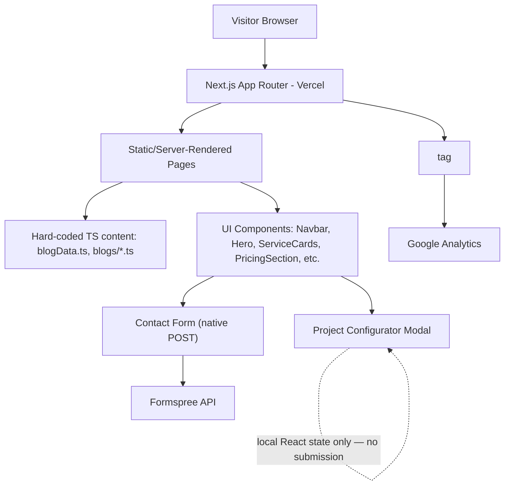

# Tejas Innovations — Marketing & Lead-Generation Website

Live site: [tejasinnovations.in](https://tejasinnovations.in) (deployed on Vercel at `tejas-drab.vercel.app`)

Tejas Innovations is the marketing website for a web-development / digital-services agency. It is a **content and lead-generation site**, not a SaaS product or dashboard — there is no user login, no database, and no custom backend API. Every page is a statically-typed Next.js route that presents the agency's services, pricing, blog content, and a set of lead-capture forms.

---

## 1. What This Project Actually Is

| | |
|---|---|
| **Type** | Marketing website / agency portfolio site |
| **Framework** | Next.js 16 (App Router), React 19, TypeScript + a mix of `.jsx` client components |
| **Styling** | Tailwind CSS v4, Framer Motion for animation |
| **Content** | Hard-coded in TypeScript files (`src/lib/blogData.ts` + one file per blog post) — no CMS is actually wired up |
| **Backend** | None. No API routes, no server actions, no database of any kind |
| **Data persistence** | None in the app itself — form submissions go to a third-party form service |
| **Auth** | None — there is nothing to authenticate |
| **Deployment** | Vercel (inferred from the "Deploy on Vercel" boilerplate and the live `vercel.app` domain) |

The project was originally scaffolded with `create-next-app`, and the original Next.js starter README (Getting Started / Learn More / Deploy on Vercel) is still present in the repo's current `README.md` — this document replaces that boilerplate with an accurate description of the actual site.

---

## 2. Site Structure & Pages

All routes live under `src/app/` (Next.js App Router):

| Route | Purpose |
|---|---|
| `/` | Homepage — hero, about, services overview, pricing teaser, FAQ, blog preview, contact CTA (assembled by `HomeContent.jsx`) |
| `/about` | Company/about page |
| `/founders` | Founder bios (`FounderCard.jsx`, uses `public/founder.png`) |
| `/services` | Services index |
| `/services/web-development` | Service detail page |
| `/services/e-commerce-applications` | Service detail page |
| `/services/qr-ordering-system` | Service detail page |
| `/services/business-automation` | Service detail page |
| `/services/ai-voice-agents` | Service detail page |
| `/services/seo-optimization` | Service detail page |
| `/services/google-profile-business-optimization` | Service detail page |
| `/pricing` | Pricing tiers (`PricingSection.jsx`) |
| `/blog` | Blog index |
| `/blog/[slug]` | Individual blog post (dynamic route) |
| `/contact` | Contact page with lead form |
| `/sitemap.xml` | Generated by `src/app/sitemap.ts` |
| `/robots.txt` | Generated by `src/app/robots.ts` |

Each of the seven service pages (`web-development`, `e-commerce-applications`, `qr-ordering-system`, `business-automation`, `ai-voice-agents`, `seo-optimization`, `google-profile-business-optimization`) follows the **same internal template**: a `HeroSection`, `ServiceOverview`, `ServiceCards`, `ProcessSection`, `ScrollReveal` (for scroll-triggered animation), and a `CTASection`, each duplicated per-service under `src/components/services/<service-name>/`. This is a repeated-template pattern rather than a shared/parameterized component — the six sub-components are copy-pasted per service directory with content swapped in.

---

## 3. Content Model (Blog)

There is no database or CMS behind the blog, despite `@sanity/client` and `next-sanity` being listed as dependencies in `package.json`. **Neither package is imported or referenced anywhere in `src/`** — Sanity is installed but unused, most likely left over from an earlier plan to wire up a headless CMS, or scaffolding that was never finished.

Instead, blog content is fully static:

```
src/lib/blogData.ts          → defines BlogPost / BlogSection / BlogFAQ types,
                                 imports and aggregates every post into blogs[]
src/lib/blogs/*.ts           → one TypeScript file per article, each exporting
                                 a single BlogPost object (title, sections, FAQs, etc.)
```

`/blog/[slug]/page.tsx` looks up the matching entry from the `blogs` array at build/request time — there's no fetch, no API call, and no revalidation logic. Adding a new post means adding a new file under `src/lib/blogs/` and importing it into `blogData.ts` by hand.

The current posts are heavily SEO-oriented (e.g. "Website Cost in India 2026", "Best SEO Agency Hyderabad 2026", "WordPress vs Custom Website 2026"), indicating the blog's primary purpose is organic search acquisition for the agency's target market (India, Hyderabad specifically).

Supporting blog components: `ReadingProgress.tsx` (scroll-based progress bar), `PostSidebar.tsx`, `ShareBar.tsx`, `StickyLayout.tsx`, and `CostHeroIllustration.tsx` (a hand-built illustrative graphic for the cost-focused article).

---

## 4. Lead Capture — Two Separate, Independent Mechanisms

The site has **two different lead-capture UIs**, and they are not equally functional. This is an important accuracy note for anyone extending the project.

### 4a. Simple contact form (`ContactSection.jsx`) — fully functional
Rendered on the `/contact` page and as a popup ("Let's Talk") triggered from other sections. This is a plain HTML `<form>` that POSTs directly to **Formspree**:

```
action="https://formspree.io/f/mnjyydeb"
method="POST"
```

Fields: name, email, phone, message. Because this is a native form POST to Formspree's endpoint, it works with no additional client-side code and requires no API route in the Next.js app.

### 4b. Multi-step "Project Configurator" (`ProjectConfigModal.jsx`) — UI only, not wired up
This is a five-step wizard (`Business → Services → Requirements → Budget → Summary`) that lets a visitor pick service types (from an 8-option list: business website, restaurant website, QR ordering, booking system, landing page, SEO, maintenance, custom app), a budget bracket in ₹, and a timeline, then shows a "Summary" step.

It is triggered from the homepage and from every one of the seven service detail pages, so it's clearly meant to be the primary conversion path. However, tracing `handleSubmit`:

```js
const handleSubmit = () => {
  setSubmitted(true);
};
```

The submit handler **only flips local component state** to show a "submitted" confirmation screen. It does not call Formspree, does not call `fetch()`, and there is no API route anywhere in the codebase for it to call. **The data the user enters in this modal is never sent anywhere** — it exists only in React state and is discarded when the modal closes. This is a UI that is visually complete but functionally a stub; any real deployment of this form needs a submission handler added (e.g., pointing it at the same Formspree endpoint, or a Next.js Route Handler).

---

## 5. Third-Party Integrations (only what's actually present)

| Service | Where used | Purpose | Notes |
|---|---|---|---|
| **Formspree** | `ContactSection.jsx` | Receives contact-form submissions via a plain form POST | No API key in code — Formspree endpoint IDs are effectively public form addresses; no server-side validation |
| **Google Analytics** | `src/app/layout.tsx` via `@next/third-parties/google`'s `<GoogleAnalytics>` component | Site analytics/pageview tracking, loaded globally in the root layout | Uses Next.js's official third-party script wrapper |
| **Google Search Console** (implied) | `public/googleeddd9bbc8a2c8bbb.html` | Domain-ownership verification file for Search Console | Static verification file only, no code integration |
| **Vercel** | Deployment target (inferred from live URL + starter boilerplate) | Hosting | Not configured in-repo (no `vercel.json`); relies on Vercel's zero-config Next.js support |

**Not actually integrated**, despite being installed as dependencies:
- `@sanity/client` / `next-sanity` — no Sanity project ID, dataset, or query is referenced anywhere. Dead dependency.

There is no payment gateway, no SMS/email service (beyond Formspree relaying form data), no AI/LLM API calls, no file upload handling, no WebSocket/real-time features, and no external logistics or booking APIs — despite service pages *marketing* things like "AI Voice Agents," "QR Ordering," and "Business Automation," these are pages **describing services the agency sells to clients**, not features implemented in this website itself.

---

## 6. Database / Data Layer

**There is none.** No Prisma schema, no MongoDB/Postgres/MySQL client, no ORM, no `.env` file defining a connection string (`.env*` is git-ignored but no example/template file exists either). All "data" in the application is:
- Hard-coded TypeScript objects (blog posts, pricing tiers, service copy)
- Ephemeral client-side React state (the configurator modal, contact form's `isOpen` state)

If a future version of this project needs persistent leads, saved blog content, or CMS-driven pages, that would be new infrastructure, not something to "fix" in existing code.

---

## 7. Architecture



There is no application-layer API between the frontend and any backend, because there is no backend — Next.js here is acting purely as a static/SSR page renderer plus a thin wrapper for SEO metadata (`sitemap.ts`, `robots.ts`, per-page `metadata` exports, and JSON-LD organization schema in `layout.tsx`).

---

## 8. Tech Stack Summary

- **Framework:** Next.js 16.2.9 (App Router), React 19.2.4
- **Language:** TypeScript for pages/config, JSX for most interactive components
- **Styling:** Tailwind CSS v4 (via `@tailwindcss/postcss`), custom design tokens in `globals.css`
- **Animation:** Framer Motion (`motion`, `AnimatePresence`) used throughout for scroll-reveal and modal transitions
- **Icons:** `lucide-react`, `react-icons`
- **Text effects:** `react-type-animation` (likely used in the Hero component for typewriter-style text)
- **Fonts:** Geist Sans / Geist Mono via `next/font/google`
- **Linting:** ESLint 9 with `eslint-config-next`

---

## 9. Getting Started

```bash
npm install
npm run dev
```

Open [http://localhost:3000](http://localhost:3000).

```bash
npm run build   # production build
npm run start   # serve the production build
npm run lint    # ESLint
```

No environment variables are required to run the app locally — there are no API keys or secrets used in the current codebase (Formspree's endpoint and the Google Analytics ID are both hard-coded, non-secret identifiers).

---

## 10. Known Gaps / Honest Caveats

- **The "Project Configurator" modal does not submit anywhere.** It's the most prominent CTA on the homepage and every service page, but currently just displays a fake "submitted" state. This should be treated as an open item, not a working lead pipeline.
- **`@sanity/client` and `next-sanity` are unused dependencies.** Either wire up a real Sanity project for the blog, or remove them to reduce bundle/install size.
- **No automated tests, CI/CD, or Docker configuration exist** in this repository.
- **No `.env.example`** — there's currently nothing that needs one, but if the Sanity integration or a real form backend is added later, one should be introduced alongside it.
